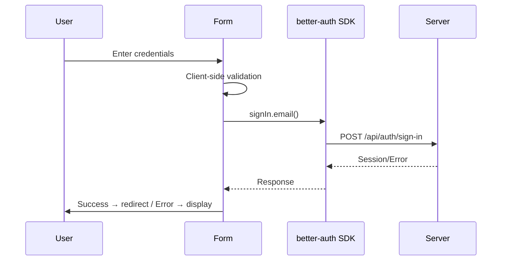

import { Step, Steps } from 'fumadocs-ui/components/steps';
import { Tab, Tabs } from 'fumadocs-ui/components/tabs';
import { Callout } from 'fumadocs-ui/components/callout';

# Getting Started

This guide will get you from zero to a working credential login form in about 5 minutes.

## Prerequisites

Before you begin, make sure you have:

- Node.js 18+
- A React application (Next.js, Vite, or TanStack Start)
- Tailwind CSS configured
- better-auth 1.4+ installed and configured

<Callout type="warn">
  If you haven't set up better-auth yet, follow the [better-auth documentation](https://better-auth.com/docs) first.
</Callout>

## Quick Setup

<Steps>
  <Step>
    ### Create the auth client

    ```typescript title="lib/auth-client.ts"
    import { createAuthClient } from 'better-auth/client'

    export const authClient = createAuthClient({
      baseURL: process.env.NEXT_PUBLIC_API_URL || 'http://localhost:3000',
    })
    ```
  </Step>

  <Step>
    ### Install the credential login block

    <Tabs items={['shadcn CLI', 'npm Package']}>
      <Tab value="shadcn CLI">
        ```bash
        npx shadcn@latest add "https://better-auth-ui.com/r/credential-login"
        ```
      </Tab>
      <Tab value="npm Package">
        ```bash
        pnpm add @better-auth-ui/components
        ```
      </Tab>
    </Tabs>
  </Step>

  <Step>
    ### Create your sign-in page

    <Tabs items={['shadcn CLI', 'npm Package']}>
      <Tab value="shadcn CLI">
        ```tsx title="app/auth/sign-in/page.tsx"
        import { CredentialLoginForm } from '@/components/auth/credential-login-form'
        import { authClient } from '@/lib/auth-client'

        export default function SignInPage() {
          return (
            <div className="flex min-h-screen items-center justify-center p-6">
              <div className="w-full max-w-sm">
                <CredentialLoginForm authClient={authClient} />
              </div>
            </div>
          )
        }
        ```
      </Tab>
      <Tab value="npm Package">
        ```tsx title="app/auth/sign-in/page.tsx"
        'use client'

        import { CredentialLoginForm } from '@better-auth-ui/components'
        import { authClient } from '@/lib/auth-client'
        import { useRouter } from 'next/navigation'

        export default function SignInPage() {
          const router = useRouter()

          return (
            <div className="flex min-h-screen items-center justify-center p-6">
              <div className="w-full max-w-sm">
                <CredentialLoginForm
                  authMethod="email"
                  authClient={authClient}
                  showRememberMe
                  showForgotPassword
                  onSuccess={() => router.push('/dashboard')}
                />
              </div>
            </div>
          )
        }
        ```
      </Tab>
    </Tabs>
  </Step>

  <Step>
    ### Test it out

    ```bash
    pnpm dev
    ```

    Navigate to `/auth/sign-in` and you should see your login form!
  </Step>
</Steps>

## What's Next?

<Cards>
  <Card
    title="Configure Authentication Methods"
    description="Email, username, or phone authentication"
    href="/docs/configuration/authentication"
  />
  <Card
    title="Customize Validation"
    description="Password rules and form validation"
    href="/docs/configuration/validation"
  />
  <Card
    title="Try the Builder"
    description="Configure components visually"
    href="/builder"
  />
  <Card
    title="Framework Guides"
    description="Next.js, Vite, TanStack Start"
    href="/docs/installation"
  />
</Cards>

## Authentication Flow

Here's what happens when a user submits the login form:



## Customization Options

The component is highly configurable:

```tsx
<CredentialLoginForm
  // Authentication method
  authMethod="email" // 'email' | 'username' | 'phone'
  authClient={authClient}

  // Optional features
  showRememberMe={true}
  showForgotPassword={true}
  forgotPasswordUrl="/auth/forgot-password"

  // Password validation
  passwordValidation={{
    minLength: 12,
    requireUppercase: true,
    requireNumbers: true,
    requireSymbols: true,
  }}

  // Callbacks
  onSuccess={() => console.log('Logged in!')}
  onError={(error) => console.error(error)}

  // Styling
  className="my-custom-class"
  classNames={{
    form: 'space-y-6',
    button: 'bg-blue-600 hover:bg-blue-700',
  }}
/>
```

See the [full API reference](/docs/components/credential-login) for all available props.

